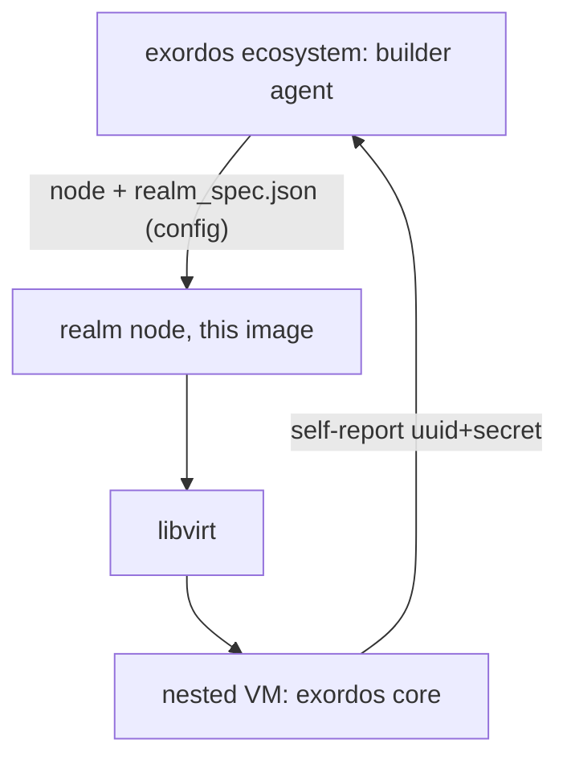

# Exordos realm node image (exordos-realm)

An all-in-one hypervisor image hosting a nested exordos core VM. It is the
node image used by the [exordos ecosystem realm
manager](https://github.com/infraguys/exordos_ecosystem) to launch **managed
(nested) realms**: the ecosystem builder agent creates a node from this image
in the central realm and delivers a realm spec to it; the node bootstraps a
fully working exordos core installation with the pre-assigned realm identity.

It can also be used standalone as a developer stand (the former
`eci_dev_all_in_one` purpose) — see [Developer stand](#developer-stand).

## How it works



1. The image is built from the `exordos_custom` profile (exordos-base): the
   universal agent inside receives config resources from the parent realm.
2. On first boot `exordos-realm-bootstrap.service` waits for
   `/etc/exordos/realm_spec.json` (delivered by the parent core as a config
   resource, contract pinned in exordos_ecosystem `docs/realm-manager.md`).
3. Once the spec arrives, the unit runs `exordos bootstrap -m core
   --realm-spec /etc/exordos/realm_spec.json` using the **baked element
   cache** (core + ecosystem_realm inventories are pre-downloaded at image
   build time), so no network access to the element repository is needed.
4. The nested core VM boots with the pre-assigned realm identity
   (uuid/secret/tokens) and admin password from the spec, self-reports to the
   ecosystem, and the managed realm flips to `ACTIVE`.

Exposed on the node addresses (via libvirt hook):

- `11010/tcp` — nested core API (proxied to `192.168.100.2:11010`)
- `53/tcp+udp` — private DNS of the nested core (proxied to `192.168.100.2:5300`)

## Requirements

- **Nested virtualization must be enabled** on the machine pools /
  hypervisors that host realm nodes (the node runs its own KVM guests).
- An x86-64 architecture is recommended.

## Build

Prerequisites: Packer, `qemu-system-amd64 qemu-kvm qemu-utils
libvirt-daemon-system libvirt-dev mkisofs`.

```bash
# Latest stable core element, no developer access
./build.sh

# Pin the baked core element version and/or enable dev access
CORE_VERSION=0.1.13 DEV_ACCESS=1 ./build.sh
```

The artifact is `output/.../images/exordos-realm.raw.zst`; the exordos
ecosystem builder expects it at
`https://repo.exordos.com/exordos-elements/exordos-realm/<version>/images/exordos-realm.raw.zst`
(see `[builder] default_realm_image` in exordos_ecosystem).

CI builds two variants: the production `exordos-realm.*` (no console access,
used by the ecosystem builder) and `exordos-realm-dev.*` (`DEV_ACCESS=1`, for
laptop developer stands — see [Developer stand](#developer-stand)).

## Developer stand

For a laptop stand, grab the **dev** artifact published by CI (built with
`DEV_ACCESS=1`) — the plain `exordos-realm.*` release assets have no console
access:

- [exordos-realm-dev.qcow2.zst](https://github.com/infraguys/eci_dev_all_in_one/releases/latest/download/exordos-realm-dev.qcow2.zst)
- [exordos-realm-dev.raw.zst](https://github.com/infraguys/eci_dev_all_in_one/releases/latest/download/exordos-realm-dev.raw.zst)

Or build it yourself with `DEV_ACCESS=1 ./build.sh`. Run the image in your
preferred virtualization software; **nested VT-x/AMD-V must be enabled** for
the machine that runs it (the stand starts its own KVM guest — check with
`kvm-ok` inside the VM). Default username/password: `ubuntu:ubuntu`.

Without a delivered realm spec the first-boot unit keeps waiting; bootstrap
the nested core manually (self-registration path):

```bash
sudo -i
. /etc/exordos/realm-image.env
exordos bootstrap -m core -i "$CORE_VERSION" -f \
    --cidr "$NESTED_CIDR" \
    --hyper-connection-uri "qemu+tcp://${NESTED_GATEWAY}/system" \
    --hyper-storage-pool exordos-realm \
    --no-registration
```

Or simulate the managed flow by writing `/etc/exordos/realm_spec.json`
yourself (see the contract in exordos_ecosystem `docs/realm-manager.md`) —
the first-boot unit picks it up.

- Core API: `http://NODE_IP:11010` (proxied to the nested VM `192.168.100.2`)
- Nested VM login: `ubuntu:ubuntu`
